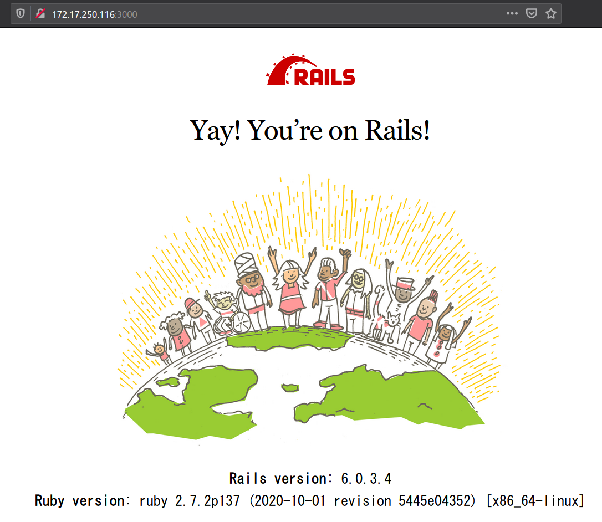

# Vagrant Hyper-V CentOS7 Rails6 setup.

## 0. env

* Windows10 1909
* Vagrant 2.2.10

:link: [Vagrant by HashiCorp](https://www.vagrantup.com/)  

---

凡例：  
`PS > ` : PowerShell のプロンプト（ホスト（Windows）側の操作）  
`$ ` : bash のプロンプト（ゲスト（CentOS7）側の操作）  

## 1. setup host

### 1.1 Box のダウンロード

```powershell
PS > vagrant box add centos/7
```

次のプロンプトが表示されたら 1 を入力してから Enter キーで確定してください。  

```powershell
1) hyperv
2) libvirt
3) virtualbox
4) vmware_desktop

Enter your choice: 1
```

### 1.2 vagrant init

```powershell
PS > mkdir rails
PS > cd .\rails\
PS rails> vagrant init centos/7
```

作成するフォルダの場所と名前は任意です。  
vagrant init で作成される Vagrantfile は編集不要です。  

### 1.3 vagrant up

```powershell
PS rails> vagrant up --provider=hyperv 
```

次のプロンプトが表示されたら 2 を入力してから Enter キーで確定してください。   

```powershell
    default: to create a new virtual switch.
    default:
    default: 1) 外部ネットワーク
    default: 2) Default Switch
    default: 3) WSL
    default:
    default: What switch would you like to use? 2
```

### 1.4 vagrant ssh

```powershell
PS rails> vagrant ssh
[vagrant@localhost ~]$ 
```

ゲスト側に ssh で入ります。
ホスト側の操作は終わりです。

## 2. setup guest

### 2.1 install required packages from yum.

```bash
$ sudo yum install https://rpm.nodesource.com/pub_12.x/el/7/x86_64/nodesource-release-el7-1.noarch.rpm
$ sudo yum install -y git wget epel-release openssl-devel readline-devel zlib-devel gcc gcc-c++
$ sudo yum install -y nodejs --enablerepo=epel
```

### 2.2 yarn install

```bash
$ curl --silent --location https://dl.yarnpkg.com/rpm/yarn.repo | sudo tee /etc/yum.repos.d/yarn.repo
$ sudo yum -y install yarn
```

### 2.3 rbenv install 

```bash
$ git clone https://github.com/sstephenson/rbenv.git ~/.rbenv
$ echo 'export PATH="$HOME/.rbenv/bin:$PATH"' >> ~/.bash_profile
$ echo 'eval "$(rbenv init -)"' >> ~/.bash_profile
$ source ~/.bash_profile
```

### 2.4 ruby-build install 

```bash
$ git clone git://github.com/sstephenson/ruby-build.git ~/.rbenv/plugins/ruby-build
$ cd ~/.rbenv/plugins/ruby-build
$ sudo ./install.sh
```

### 2.5 ruby install 

rbenv からインストールします。  
`rbenv install -l` からインストールできるバージョンを確認します。

```bash
$ rbenv install -l
2.5.8
2.6.6
2.7.2
jruby-9.2.13.0
maglev-1.0.0
mruby-2.1.2
rbx-5.0
truffleruby-20.2.0
truffleruby+graalvm-20.2.0

Only latest stable releases for each Ruby implementation are shown.
Use 'rbenv install --list-all' to show all local versions.
```

今回は 2.7.2 をインストールします。  

```bash
$ rbenv install 2.7.2
$ rbenv rehash
$ rbenv global 2.7.2
```

※選択したバージョンによって末尾のバージョン部分を置き換えてください。  

最後に `ruby -v` で指定したバージョンで正しくインストールされているか確認してください。

```bash
$ ruby -v
ruby 2.7.2p137 (2020-10-01 revision 5445e04352) [x86_64-linux]
```

### 2.5 gem install rails

必要に応じてバージョンを指定してください。

```bash
gem install rails
```

```bash
$ rails -v
Rails 6.0.3.4
```

### 2.6 OPTION SQLite install

CentOS7 のパッケージからインストールするとバージョンが古いので Rails 6 では動作できません。  
ソースからコンパイルしてインストールします。  

```bash
$ wget https://www.sqlite.org/2019/sqlite-autoconf-3300100.tar.gz
$ tar xvfz sqlite-autoconf-3300100.tar.gz
$ cd sqlite-autoconf-3300100
$ ./configure --prefix=/usr/local
$ make
$ sudo make install
$ bundle config build.sqlite3 "--with-sqlite3-lib=/usr/local/lib"
$ cd ~
```

### 2.7 firewall disabled

動作確認の為に無効にしますが、必要に応じてルールを適用してサービスを起動してください。

```powershell
$ sudo systemctl stop firewalld.service
$ sudo systemctl mask firewalld.service
$ sudo systemctl list-unit-files | grep firewalld
```

### 2.8 ip addr show

ip アドレス確認。  

```bash
$ ip addr show
1: lo: <LOOPBACK,UP,LOWER_UP> mtu 65536 qdisc noqueue state UNKNOWN group default qlen 1000
    link/loopback 00:00:00:00:00:00 brd 00:00:00:00:00:00
    inet 127.0.0.1/8 scope host lo
       valid_lft forever preferred_lft forever
    inet6 ::1/128 scope host
       valid_lft forever preferred_lft forever
2: eth0: <BROADCAST,MULTICAST,UP,LOWER_UP> mtu 1500 qdisc mq state UP group default qlen 1000
    link/ether 00:15:5d:01:89:03 brd ff:ff:ff:ff:ff:ff
    inet 172.17.250.116/28 brd 172.17.250.127 scope global noprefixroute dynamic eth0
       valid_lft 86131sec preferred_lft 86131sec
    inet6 fe80::215:5dff:fe01:8903/64 scope link
       valid_lft forever preferred_lft forever

```

eth0 inet のアドレスをメモしておいてください。

### 2.9 rails new & rails s

```bash
$ cd ~
$ rails new rails-test
$ cd rails-test/
$ rails s -b 0.0.0.0
```

ホスト側のブラウザから `http://前項 2.8 で確認したアドレス:3000` にアクセスしてください。  
サンプルは `http://172.17.250.116:3000/`  

  